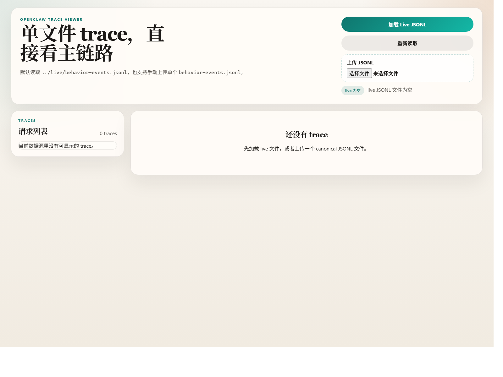
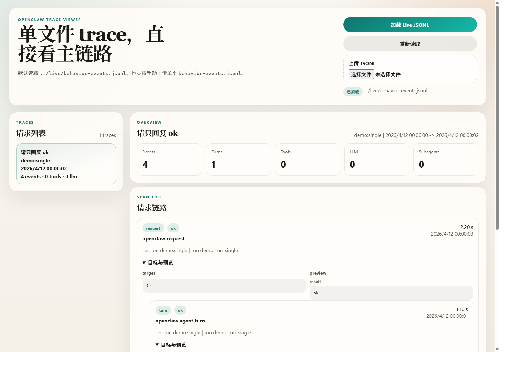
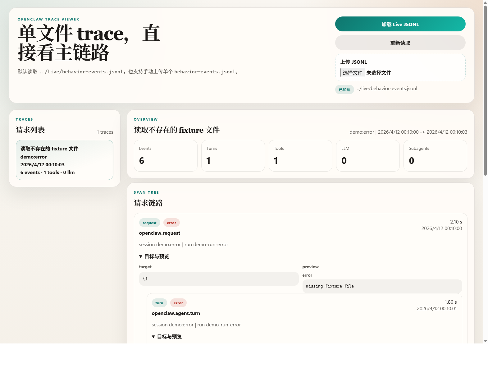

# Transpect

Transpect packages the OpenClaw trace runtime, a browser viewer, OTEL observability integration, and Windows-oriented Frida capture helpers into a single repository layout that can be cloned and used directly.

## What This Repository Contains

- A browser viewer for `live/behavior-events.jsonl`
- Runtime setup scripts that patch `~/.openclaw/openclaw.json`
- A behavior mediator plugin that writes canonical JSONL trace events
- An OpenTelemetry plugin subtree for OTLP export
- A Frida capture path for Windows gateway inspection
- Acceptance fixtures and repository checks

## Directory Layout

```text
viewer/                         Browser UI for trace inspection
scripts/                        Runtime setup, start, diagnostics, validation
tests/fixtures/                 Minimal prompts used by acceptance checks
config/                         Portable templates and generated local configs
frida/                          Windows Frida hook script
vendor/openclaw-behavior-mediator/
vendor/openclaw-observability-plugin/
docs/                           Architecture, OTEL, Frida, and screenshots
live/                           Runtime JSONL, logs, acceptance output
captures/                       Reserved for exported capture material
bin/                            Reserved for optional local tools
```

## Requirements

- Windows with PowerShell is the primary tested environment
- Python 3.11 or newer
- Node.js 20 or newer
- npm 10 or newer
- OpenClaw CLI installed and available as `openclaw`
- A configured `~/.openclaw/openclaw.json`

Optional components:

- `otelcol-contrib` if you want local OTLP collection
- `pip install -r requirements.txt` if you want to use Frida capture helpers

## Quick Start

1. Install the baseline dependencies.

```powershell
python --version
node --version
npm --version
openclaw --version
```

2. Install the optional Python dependency if you want Frida support.

```powershell
pip install -r requirements.txt
```

3. Prepare the OpenClaw runtime for the default trace mode.

```powershell
python scripts/setup_runtime.py --mode core
```

4. Start the gateway and the viewer.

```powershell
python scripts/start_trace.py
```

5. Open the viewer if your browser does not open automatically.

```text
http://127.0.0.1:8711/viewer/index.html?view=traces
```

## Runtime Modes

### `core`

- Enables `behavior-mediator`
- Disables the OTEL plugin
- Starts the browser viewer over `live/behavior-events.jsonl`

```powershell
python scripts/setup_runtime.py --mode core
python scripts/start_trace.py --mode core
```

### `hybrid`

- Keeps the JSONL trace pipeline
- Enables the OTEL plugin
- Renders `config/otel-collector.local.yaml`

```powershell
python scripts/setup_runtime.py --mode hybrid --render-otel-config
python scripts/start_trace.py --mode hybrid
```

### `otel`

- Enables the OTEL plugin only
- Renders `config/otel-collector.local.yaml`
- Skips the browser viewer when started through `scripts/start_trace.py`

```powershell
python scripts/setup_runtime.py --mode otel --render-otel-config
python scripts/start_trace.py --mode otel
```

## OpenTelemetry

To keep OTLP output local, the repository uses a generated collector config that writes files under `live/otel/`.

1. Render the local collector config.

```powershell
python scripts/setup_runtime.py --mode hybrid --render-otel-config
```

2. Install the OTEL plugin dependencies.

```powershell
npm ci --prefix vendor/openclaw-observability-plugin
```

3. Start your collector with the rendered config.

```powershell
otelcol-contrib --config config/otel-collector.local.yaml
```

More details are in [docs/observability.md](docs/observability.md).

## Frida

The Frida capture path is optional and currently targets a Windows OpenClaw gateway process.

```powershell
python scripts/capture_frida.py
```

More details are in [docs/frida.md](docs/frida.md).

## Outputs

- Main trace stream: `live/behavior-events.jsonl`
- Viewer and gateway fallback logs: `live/logs/`
- OTEL local export files: `live/otel/`
- Frida capture output: `live/frida/`
- Acceptance reports: `live/acceptance/`
- Archived cleanup material: `live/archive/`

## Validation

Run the repository checks after cloning or before publishing changes.

```powershell
python -m py_compile scripts/*.py
python scripts/check_repo.py --skip-start
python scripts/doctor.py
python scripts/run_acceptance.py
```

For the OTEL plugin subtree:

```powershell
npm ci --prefix vendor/openclaw-observability-plugin
npm --prefix vendor/openclaw-observability-plugin run typecheck
```

## Screenshots

Current UI screenshots are stored under `docs/images/`.





## Troubleshooting

- If `setup_runtime.py` reports that `~/.openclaw/openclaw.json` is missing, initialize OpenClaw first and then rerun the command.
- If the viewer starts but stays empty, confirm that `live/behavior-events.jsonl` exists and then run `python scripts/doctor.py`.
- If `run_acceptance.py` cannot find fixture files, verify that the repository root was not changed and that you are running commands from the cloned repository.
- If OTEL is enabled but `live/otel/` stays empty, verify that your collector is running with `config/otel-collector.local.yaml`.
- If Frida cannot attach, confirm that the OpenClaw gateway process is running and that the Python `frida` package is installed.

## Safety Notes

- `scripts/setup_runtime.py` writes to your local `~/.openclaw/openclaw.json` and stores backups in `config/applied/`, which are ignored by git.
- `.gitignore` excludes runtime state, rendered configs, `node_modules/`, and screenshots outside the three repository images.
- Do not commit secrets, `.env` files, runtime logs, or generated capture outputs.

## Additional Docs

- [Architecture](docs/architecture.md)
- [OTEL Observability](docs/observability.md)
- [Frida Capture](docs/frida.md)
