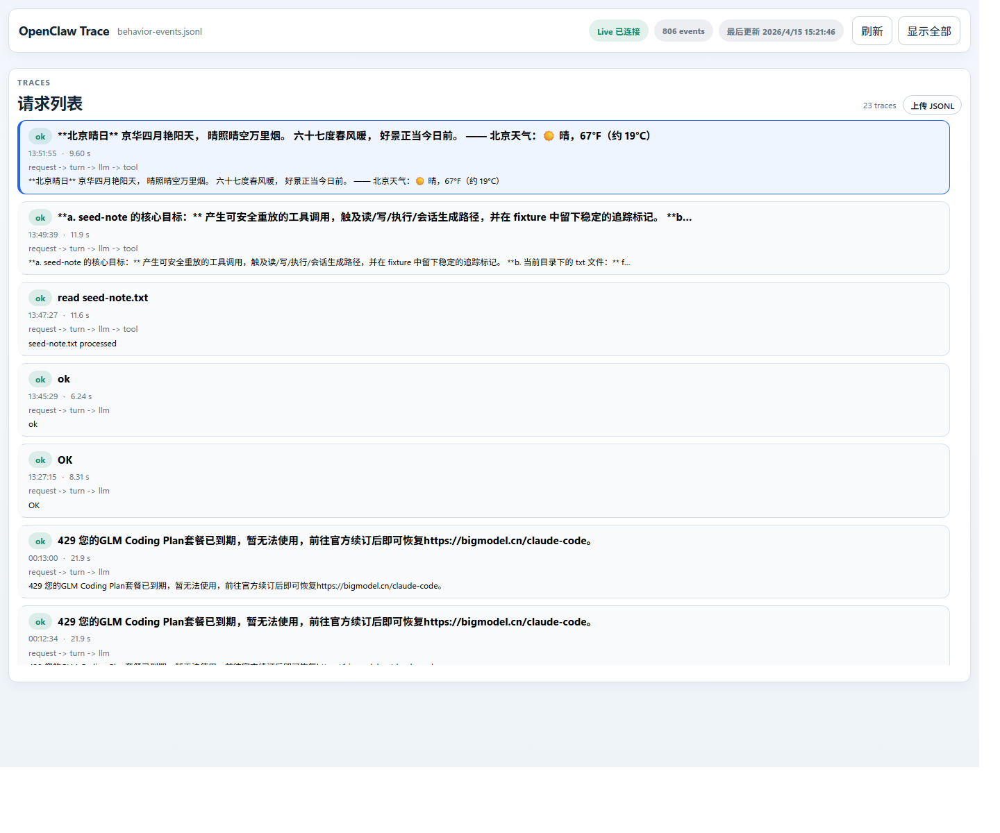
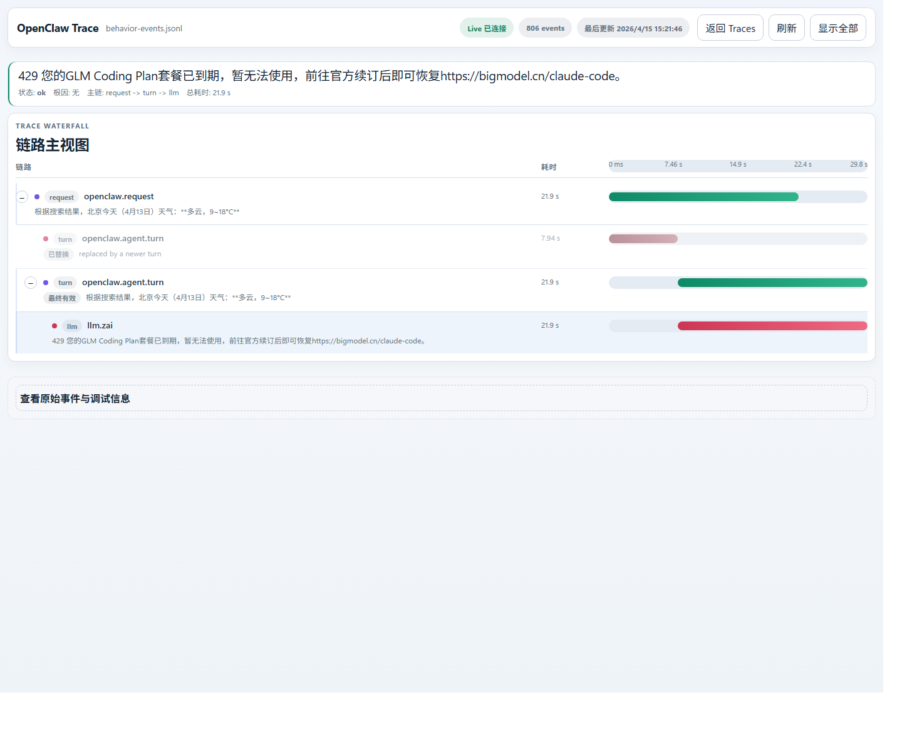

# Transpect

Transpect 将 OpenClaw Trace 运行链路、可视化查看器、OTEL 可观测性能力和 Windows 定向的 Frida 捕获能力整理到同一个仓库中，目标是让用户在全新克隆后，按文档步骤即可直接启动和排查。

## 项目简介

本仓库提供三条互补的数据路径：

- JSONL 主链路：`OpenClaw hooks -> behavior-mediator -> live/behavior-events.jsonl -> OpenClaw Trace viewer`
- OTEL 链路：`OpenClaw hooks -> otel-observability -> OTLP -> live/otel/`
- Frida 链路：`Frida attach -> frida/openclaw_gateway_windows.js -> live/frida/`

其中默认使用的是 JSONL 主链路。它最轻量、启动最快，也最适合直接查看请求、轮次、工具调用、任务节点和 LLM 调用过程。

## 仓库包含内容

- `live/behavior-events.jsonl` 对应的 OpenClaw Trace 查看器
- 自动调整 `~/.openclaw/openclaw.json` 的运行时配置脚本
- 负责产出标准化 JSONL 事件的 `behavior-mediator` 插件
- 用于 OTLP 导出的 `otel-observability` 插件子树
- 面向 Windows 网关进程的 Frida 捕获脚本
- 用于验收和仓库检查的最小化 fixture 与检查脚本

## 目录结构

```text
viewer/                         OpenClaw Trace 页面与前端逻辑
scripts/                        初始化、启动、诊断、验收、仓库检查脚本
tests/fixtures/                 验收时使用的最小输入文件
config/                         模板配置与本地渲染配置说明
frida/                          Windows 定向 Frida hook 脚本
vendor/openclaw-behavior-mediator/
vendor/openclaw-observability-plugin/
docs/                           架构、OTEL、Frida 和运行截图说明
live/                           JSONL、日志、验收结果等运行产物目录
captures/                       预留给导出产物的目录
bin/                            预留给本地工具的目录
```

## 环境依赖

- Windows + PowerShell
- Python 3.11 或更高版本
- Node.js 20 或更高版本
- npm 10 或更高版本
- 已安装并可直接调用的 `openclaw` CLI
- 已存在的 `~/.openclaw/openclaw.json`

可选依赖：

- `otelcol-contrib`：仅在需要本地 OTLP 收集时使用
- `pip install -r requirements.txt`：仅在需要 Frida 捕获时使用

## 快速开始

1. 先确认基础依赖可用。

```powershell
python --version
node --version
npm --version
openclaw --version
```

2. 如果需要 Frida，再安装可选 Python 依赖。

```powershell
pip install -r requirements.txt
```

3. 初始化默认运行模式。

```powershell
python scripts/setup_runtime.py --mode core
```

4. 启动网关和查看器。

```powershell
python scripts/start_trace.py
```

5. 如果浏览器没有自动打开，手动访问 `请求列表` 页面。

```text
http://127.0.0.1:8711/viewer/index.html?view=traces
```

## 运行模式

### `core`

- 启用 `behavior-mediator`
- 关闭 OTEL 插件
- 启动 OpenClaw Trace 查看器，并读取 `live/behavior-events.jsonl`

```powershell
python scripts/setup_runtime.py --mode core
python scripts/start_trace.py --mode core
```

### `hybrid`

- 保留 JSONL 主链路
- 同时启用 OTEL 插件
- 渲染 `config/otel-collector.local.yaml`

```powershell
python scripts/setup_runtime.py --mode hybrid --render-otel-config
python scripts/start_trace.py --mode hybrid
```

### `otel`

- 仅启用 OTEL 插件
- 渲染 `config/otel-collector.local.yaml`
- 通过 `scripts/start_trace.py` 启动时不再打开查看器

```powershell
python scripts/setup_runtime.py --mode otel --render-otel-config
python scripts/start_trace.py --mode otel
```

## OTEL 使用方法

如果你希望把 OTLP 数据落到本地文件，可以按下面的顺序执行：

1. 生成本机 collector 配置。

```powershell
python scripts/setup_runtime.py --mode hybrid --render-otel-config
```

2. 安装 OTEL 插件依赖。

```powershell
npm ci --prefix vendor/openclaw-observability-plugin
```

3. 启动本地 collector。

```powershell
otelcol-contrib --config config/otel-collector.local.yaml
```

更多说明见 [docs/observability.md](docs/observability.md)。

## Frida 使用方法

Frida 链路是可选能力，目前面向 Windows 上运行的 OpenClaw gateway 进程。

```powershell
python scripts/capture_frida.py
```

更多说明见 [docs/frida.md](docs/frida.md)。

## 输出目录

- 主 trace 文件：`live/behavior-events.jsonl`
- 查看器与网关回退日志：`live/logs/`
- OTEL 导出文件：`live/otel/`
- Frida 捕获输出：`live/frida/`
- 验收结果：`live/acceptance/`
- 归档清理结果：`live/archive/`

## 验证与检查

在克隆后或准备提交前，建议至少执行一次下面的检查：

```powershell
python -m py_compile scripts/*.py
python scripts/check_repo.py --skip-start
python scripts/doctor.py
python scripts/run_acceptance.py
```

如果需要验证 OTEL 插件子树：

```powershell
npm ci --prefix vendor/openclaw-observability-plugin
npm --prefix vendor/openclaw-observability-plugin run typecheck
```

## 运行截图

当前截图放在 `docs/images/`，对应的是查看器的两个正式路由：

- `view=traces` 对应 `请求列表`
- `view=timeline&traceId=<trace-id>` 对应 `链路主视图`




## 常见问题

- 如果 `setup_runtime.py` 提示找不到 `~/.openclaw/openclaw.json`，先完成 OpenClaw 的基础初始化，再重新执行命令。
- 如果查看器启动后没有数据，先确认 `live/behavior-events.jsonl` 已存在，再执行 `python scripts/doctor.py`。
- 如果 `run_acceptance.py` 找不到 fixture，确认当前命令是在仓库根目录下执行，且仓库目录结构没有被手工改动。
- 如果已启用 OTEL 但 `live/otel/` 没有产物，确认 collector 正在使用 `config/otel-collector.local.yaml` 运行。
- 如果 Frida 无法附着，确认 OpenClaw gateway 进程已经启动，并且当前环境已安装 Python `frida` 包。

## 安全说明

- `scripts/setup_runtime.py` 会修改你本机的 `~/.openclaw/openclaw.json`，同时把备份写到 `config/applied/`。这些内容默认不会进入 git。
- `.gitignore` 已经排除了运行态数据、渲染后的本地配置、`node_modules/` 以及非正式截图。
- 不要提交密钥、`.env`、日志、运行产物或本机专属配置。

## 其他文档

- [架构说明](docs/architecture.md)
- [OTEL 说明](docs/observability.md)
- [Frida 说明](docs/frida.md)
